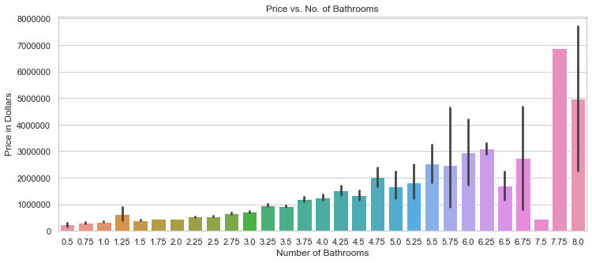
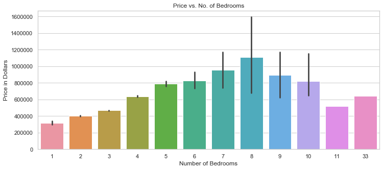
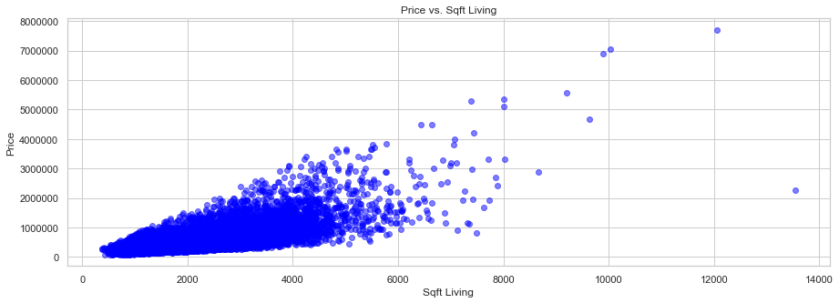
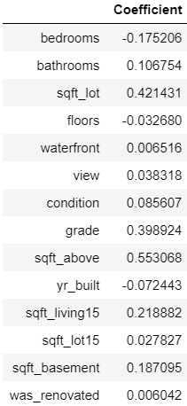

# Module 2 Final Project

## Outline
-----------------------------------------
    ├── LICENSE
    ├── README.md                  <- The project layout (this file)
    ├── zippedData                 <- This is where the project data is located
    │
    ├── student.ipynb              <- This is the main notebook (contains the python code)
    │
    ├── reports                    <- Reports and presentations
    │   └── presentation.pdf       <- Non-technical presentation
    │
    ├── images                     <- Where the graphs are saved
    ├── requirements.txt           <- The requirements file for reproducing the analysis environment

## Conclusion

### Does renovation raise the value of a house?

According to the Price vs. Was Renovated bar graph, renovation alone does slightly increase the average price of a house. However, the increase is not substantial enough to definitively support renovation before selling a house, unless that renovation increases the condition rating of the house.

### Does the number of bathrooms and/or bedrooms affect the value of a house?

According to the Price vs. No. of Bathrooms bar graph, the greater the number of bathrooms in a house, the higher the price. Therefore, if the house is being sold, it may be a good idea to add bathrooms to increase the value of the house. According to the Price vs. No. of Bedrooms bar graph, the greater the number of bedrooms (up until 8), the greater the price. So adding bedrooms could also increase the value of the house if it is being sold.

### Is the living sqft of a house correlated with its price?

According to the Price vs. Sqft Living scatter plot, there is a positive correlation between the living sqft of a house and its price. 

### Does being on the water increase the value of a house?

According to the Price vs. Waterfront bar graph, a house on the water has a higher average price than a house that is not on the water. However, there is not a significant difference between them. 

### Linear Regression Model:

Model 2 was the best model with the highest R^2 value, the coefficient of determination, with a value of 0.819681. That means that there is 81.9681% less variation around the best fit line than the mean. In other words, the model explains 81.9681% of the variation in the data.

In addition, model 2 had the coefficients in the above dataframe, with sqft_above having the highest coefficient of 0.553068 after scaling.

Model 2 contained the following features: bedrooms, bathrooms, sqft_lot, floors, waterfront, view, condition, grade, sqft_above, yr_built, sqft_living15, sqft_lot15, sqft_basement, was_renovated, and zipcode.

OneHotEncoding was applied to zipcodes since it is a nominal variable and thus has no order. Ordinal features were left as integers since they have a clear order.

## Recommendations

Based on the above information, the number of bathrooms, bedrooms, amount of living space/sqft, the condition rating, and having a waterfront all affect the value of a house. However, only the first five can be utilized to increase the value of a current house before a sale. Therefore, to maximize the value of a house, renovation may increase the value of the house, especially if it increases the condition rating. Furthermore, if the house has less than 8 bedrooms, consider adding more. Also, adding bathrooms may increase the value of the house. These would also increase the sqft living of the house as well, which has a positive correlation with the price of the house. 
